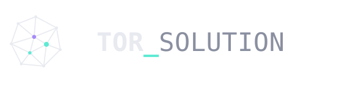

# TOR_SOLUTION — Logo (Geodesic / A1)

Vector logo package. All files are SVG (scalable, crisp at any size).

## Palette
- Ink (dark):    `#E8EAF0`   ·  Ink (light): `#0B0D14`
- Mute:          `#8A8FA0` (dark) · `#5A6072` (light)
- Mint accent:   `#5EEAD4` (dark) · `#0E9F8B` (on light bg)
- Violet accent: `#A78BFA` (dark) · `#7C5CE0` (on light bg)
- Background:    `#07080D` / `#0A0B12`

## Type
Wordmark: **JetBrains Mono** (700 + 500). Lockup SVGs load the font via Google Fonts.
If you embed these in a page that already loads JetBrains Mono, they'll match perfectly.

## Files
**Lockups (icon + wordmark)**
- `logo-horizontal-color-dark.svg`  → navbar / dark backgrounds (default)
- `logo-horizontal-color-light.svg` → light backgrounds
- `logo-horizontal-mono-white.svg`  → single-colour white
- `logo-horizontal-mono-black.svg`  → single-colour black / print
- `logo-stacked-color-dark.svg`     → hero / footer, dark
- `logo-stacked-color-light.svg`    → hero / footer, light

**Icon only**
- `icon-color-dark.svg`, `icon-color-light.svg`
- `icon-mono-white.svg`, `icon-mono-black.svg`, `icon-mono-mint.svg`

**Favicon / app icon**
- `favicon.svg`        → simplified mark for browser tabs (dark UI)
- `favicon-light.svg`  → simplified mark for light tabs
- `app-icon-dark.svg`  → rounded tile, dark
- `app-icon-mint.svg`  → rounded tile, mint

## Usage
```html
<!-- navbar -->

<!-- favicon -->
<link rel="icon" href="favicon.svg" type="image/svg+xml">
```

## Rules
- Keep clearspace equal to the icon height on all sides.
- Don't recolour the mint / violet nodes independently — use the colorways provided.
- For sizes under ~20px use `favicon.svg` (simplified), not the full icon.

Open `index.html` to preview the whole set.
